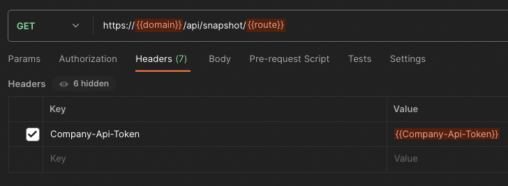

# API Endpoints

## GET /projects/issues

**Description**: Retrieves a list of issues.

**Example Postman**:



- `domain`: String, ask `Acuity Support`
- `route`: String, `/projects/issues`
- `Company-Api-Token`: UUID, ask `Acuity Support`

**Response**:

```json
{
 [
  {
   "id": "integer",
   "action_plan": "text",
   "created_at": "date",
   "description": "text",
   "issue_owner": "string",
   "name": "string",
   "notes": "text",
   "priority": "option",
   "project_name": "string",
   "resolution": "text",
   "resolution_date": "date",
   "status": "option",
   "updated_at": "date"
   }
 ]
}
